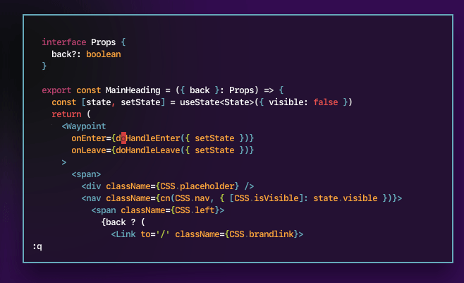
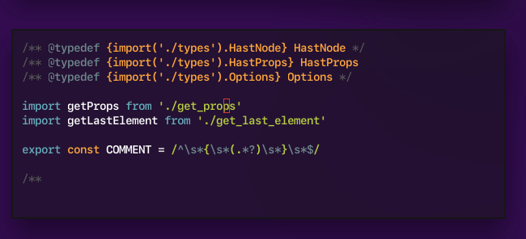
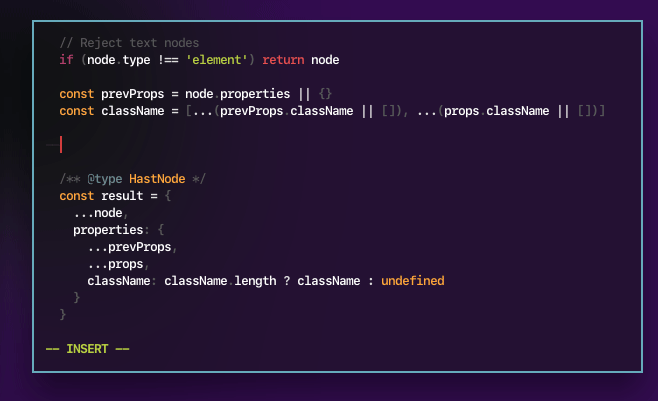
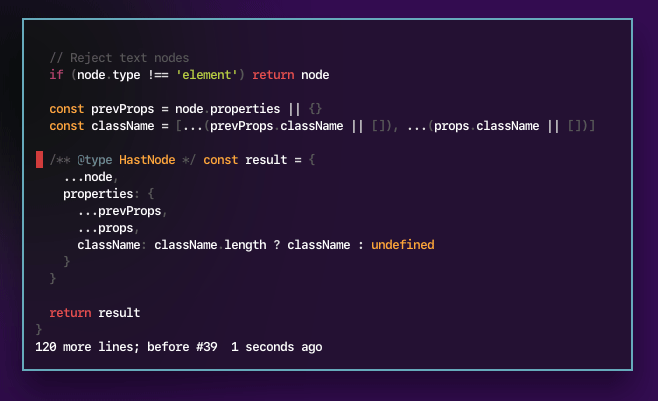

# Rico's Neovim + Coc settings

:wave: Hey there, here's my setup on how I use coc.nvim to make my Vim work like an IDE.

## Requisites

You need `neovim` (or `vim` 8.1+), `nodejs` and `yarn`.

| Platform             | Command                               |
| -------------------- | ------------------------------------- |
| macOS (via Homebrew) | `brew install nodejs neovim yarn`     |
| Arch Linux           | `sudo pacman -Syu nodejs neovim yarn` |

I suggest using [vim-plug](https://github.com/junegunn/vim-plug) to manage your dependencies.

## Files here

The files in this repo are things you can merge into your Neovim configuration:

| File                                                          | Desrcpition                         |
| ------------------------------------------------------------- | ----------------------------------- |
| ~/.config/nvim/[init.vim](./init.vim)                         | List of plugins to load             |
| ~/.config/nvim/[coc-settings.json](./coc-settings.json)       | Settings for coc-nvim               |
| ~/.config/nvim/[after/plugin/coc.vim](./after/plugin/coc.vim) | Key bindings and other Coc settings |

If you're using Vim instead of Neovim, take what's in `init.vim` and place it in `~/.vimrc`.

## Also see

Many of the configuration are lifted from almost-verbatim from Coc documentation. I highly recommend checking those out too.

- https://github.com/neoclide/coc.nvim/#example-vim-configuration

## Key bindings

See [after/plugin/coc.vim](.after/plugin/coc.vim) for a full list of key bindings. Below are some of the features that I find to be most useful:

<table>

<tr>
<td>Key</td>
<td>Description</td>
</tr>

<tr>
<td>
<kbd>gh</kbd> &mdash; <strong>Show hint</strong>
</td>
<td>
Shows a hint for whatever's on the cursor. This means type definitions, JSDoc comments, and documentation (when available).

</td>
</tr>

<tr>
<td>
<kbd>g</kbd><kbd>h</kbd> &mdash; <strong>Show hint/documentation</strong>
</td>
<td>
Shows a hint for whatever's on the cursor. This means type definitions, JSDoc comments, and documentation (when available). Similar to VSCode's mouse over functionality.
 

</td>
</tr>

<tr>
<td>
<kbd>space</kbd>-<kbd>c</kbd><kbd>r</kbd> &mdash; <strong>Rename symbol</strong>
</td>
<td>
Rename whatever is on the cursor. Similar to VSCode's Rename Symbol command (F2).
 

</td>
</tr>

<tr>
<td>
<kbd>ctrl</kbd>-<kbd>n</kbd> &mdash; <strong>Code completion</strong>
</td>
<td>
Code completion just happens. `ctrl`-`n` and `ctrl`-`p` are default Vim key bindings for browsing through code completions.
 

</td>
</tr>

<tr>
<td>
<kbd>space</kbd>-<kbd>c</kbd><kbd>c</kbd>-<kbd>prettier</kbd> &mdash; <strong>Prettier</strong>
</td>
<td>
Prettier happens on every save - automatically! You can also trigger it manually via invoking Coc commands via `space`-`c`-`c`.
 

</td>
</tr>

</table>

## References

- These were extracted from [rstacruz/vimfiles](https://github.com/rstacruz/vimfiles/).
- These work great with [rstacruz/vim-for-scratch](https://github.com/rstacruz/vim-from-scratch).
